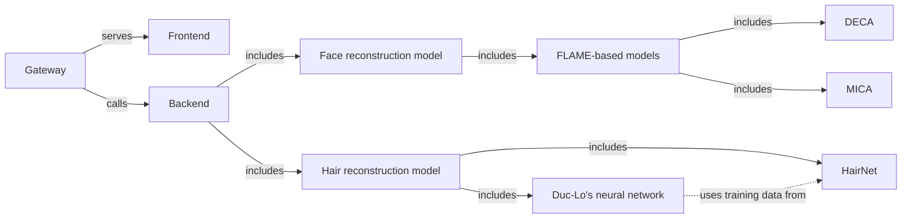

# Face & hair reconstruction from a single image server

## Project structure


## How to run
### Prerequisites
- Linux-based OS (or Docker or Docker-in-WSL2)
- CUDA supported GPU
- **Separate conda environments for each server**. This is important because of conflicting dependencies in the different servers which makes it impossible to run them in the same environment.

### Install dependencies
For DECA and MICA, follow the instructions in their respective repositories. Then install flask in the respective environments.

For the gateway server, install fastapi and uvicorn.

### Run servers
**Gateway server**

The gateway server is used to serve the frontend and calls the backend. 
It uses FastAPI and can be run with uvicorn.
```bash
python -m uvicorn server:webapp --reload --host 0.0.0.0 --port 8000
```

**DECA server**

The DECA server is used to serve input to a DECA based-model.
It uses Flask and can be run with flask. Server is run on port 11200.
```bash
conda run -n <YOUR_DECA_ENV> --no-capture-output \
 python -m flask run -p 11200
```

**MICA server**

The MICA server is used to serve input to a MICA based-model.
It uses Flask and can be run with flask. Server is run on port 11100.
```bash
conda run -n <YOUR_MICA_ENV> --no-capture-output \
python -m flask run -p 11100
```

**HairNet server**

Work in progress

### Use the UI

Go to the site: http://localhost:8000/upload-ui